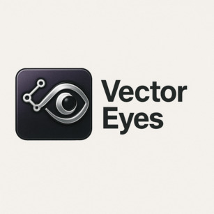

# SFA VectorEyes



## Overview

SFA VectorEyes is a powerful tool for vulnerability report vectorization and detection library building for smart contract security analysis. It enables security researchers, auditors, and blockchain developers to create, manage, and apply sophisticated vulnerability detection templates to identify security issues in smart contracts.

## Key Features

### Vulnerability Report Vectorization
- Accept vulnerability reports from URLs, Markdown files, or GitHub repositories
- Extract and analyze vulnerability types, patterns, and insights
- Generate detection patterns and templates using LLM analysis

### Detection Library Building
- Aggregate vectorized reports by vulnerability category
- Generate comprehensive detection templates with LLM enhancement
- Create a robust vulnerability detection library for smart contract scanning

### Secure API Key Management
- Session-only API key storage with no disk persistence
- Support for both local (Ollama) and cloud (OpenRouter) LLM services
- Easy switching between different LLM providers during runtime

### Database Management
- SQLite-based storage for vulnerability reports and detection patterns
- Tools to view, manage, and clean database entries
- Export and import capabilities for sharing vulnerability knowledge

## Prerequisites

- Python 3.8 or higher
- [Astral uv](https://astral.sh/uv) for dependency management and running the application
- [Ollama](https://ollama.ai/) (optional, for local LLM processing)
- OpenRouter API key (optional, for cloud LLM processing)

## Installation

SFA VectorEyes is designed as a single file application with dependencies specified at the top of the file. This makes installation and usage straightforward:

1. Clone the repository or download the SFA_VectorEyes.py file
2. Ensure you have Astral uv installed (`pip install uv`)
3. Run the application using uv

```bash
# Run the application
uv run SFA_VectorEyes.py
```

No separate installation steps are required as uv will handle all dependencies automatically.

## Usage Guide

### First Launch

When you first launch SFA VectorEyes, you'll be prompted to choose between local (Ollama) or cloud (OpenRouter) LLM services:

```
╭────────────── Welcome to SFA VectorEyes ─────────────────╮
│ API Key Selection                                        │
│                                                          │
│ You can use Ollama (local) or OpenRouter (cloud) for LLM │
│ services.                                                │
│ OpenRouter provides access to more powerful models but   │
│ requires an API key.                                     │
│ For security, your API key will only be stored in memory │
│ for this session.                                        │
╰──────────────────────────────────────────────────────────╯
Would you like to use OpenRouter? [yes/no] (no):
```

If you choose OpenRouter, you'll be prompted to enter your API key, which will be stored securely in memory only for the current session.

### Main Menu

The main menu provides access to all SFA VectorEyes features:

```
╭─────────────────────────────────────────────────╮
│                                                 │
│  SFA VectorEyes                                 │
│                                                 │
╰─────────────────────────────────────────────────╯
╭────────────────── Main Menu ──────────────────╮
│                                               │
│  1. Vectorize Report                          │
│                                               │
│  2. View Reports                              │
│                                               │
│  3. Delete Reports                            │
│                                               │
│  4. Build & Save Detection Library            │
│                                               │
│  5. View Detection Library                    │
│                                               │
│  6. Delete Detection Library Entries          │
│                                               │
│  7. Update API Keys                           │
│                                               │
│  8. Exit                                      │
│                                               │
╰───────────────────────────────────────────────╯
```

### Vectorizing a Report

1. Select option 1 from the main menu
2. Enter the URL of a vulnerability report (GitHub issues, blog posts, etc.)
3. The report will be downloaded, analyzed, and vectorized
4. The resulting vulnerability data will be stored in the database

### Building a Detection Library

1. Select option 4 from the main menu
2. SFA VectorEyes will process all vectorized reports
3. Reports will be categorized by vulnerability type
4. Advanced detection templates will be generated for each vulnerability type
5. The complete detection library will be saved to the database

### Managing API Keys

SFA VectorEyes uses a secure, session-only approach to API key management:

1. Select option 7 from the main menu
2. View current API settings (with masked API key for security)
3. Update your OpenRouter API key
4. Switch between local (Ollama) and cloud (OpenRouter) providers
5. Update the default model for either provider

API keys are never saved to disk, ensuring maximum security.

```
╭────────── Session-Based API Key Management ──────────╮
│ API Key Management                                   │
│                                                      │
│ Update your API keys for the current session.        │
│ For security, keys are only stored in memory and not │
│ saved to disk.                                       │
╰──────────────────────────────────────────────────────╯
                                                        
 API Provider         openrouter                        
 OpenRouter API Key   sk-o*********************…        
 Default Model        deepseek/deepseek-r1-distill-l…   
                                                        

1. Update OpenRouter API Key
2. Switch to Ollama (local)
3. Switch to OpenRouter (cloud)
4. Update Default Model
5. Back to Main Menu
```

## Integration with DeepCurrent

SFA VectorEyes is designed to work seamlessly with DeepCurrent:

1. Use SFA VectorEyes to create a robust vulnerability detection library
2. Transfer templates to DeepCurrent using the `copy_templates.py` script
3. DeepCurrent can then use these templates for vulnerability scanning

```bash
# Copy templates from VectorEyes to DeepCurrent
uv run copy_templates.py
```

## Workflow Examples

### Basic Workflow

1. Vectorize multiple vulnerability reports (option 1)
2. Build and save the detection library (option 4)
3. Copy templates to DeepCurrent for vulnerability scanning
4. Scan smart contracts using DeepCurrent's vulnerability detection

### Report Cleanup Workflow

1. Use `remove_unknown_reports.py` to clean up the database
2. Rebuild the detection library with clean data
3. Copy updated templates to DeepCurrent

## Best Practices

- **Security**: Use the session-based API key management for maximum security
- **Model Selection**: For detailed analysis, use powerful OpenRouter models; for quick analysis, use local Ollama models
- **Regular Updates**: Regularly add new vulnerability reports to improve detection capabilities
- **Clean Data**: Periodically clean the database of unknown or low-quality reports

## Troubleshooting

- **LLM Connection Issues**: Verify your internet connection and API keys
- **Database Errors**: Ensure you have appropriate permissions for file access
- **Template Generation Failures**: Try using a more powerful model or simplifying the report

## License

[MIT License](LICENSE)

## Acknowledgments

- Developed by [pxng0lin/ThΞ CxgΞ
- Enhanced with secure API key management for improved security
- Leveraging cutting-edge LLM technology for vulnerability analysis
